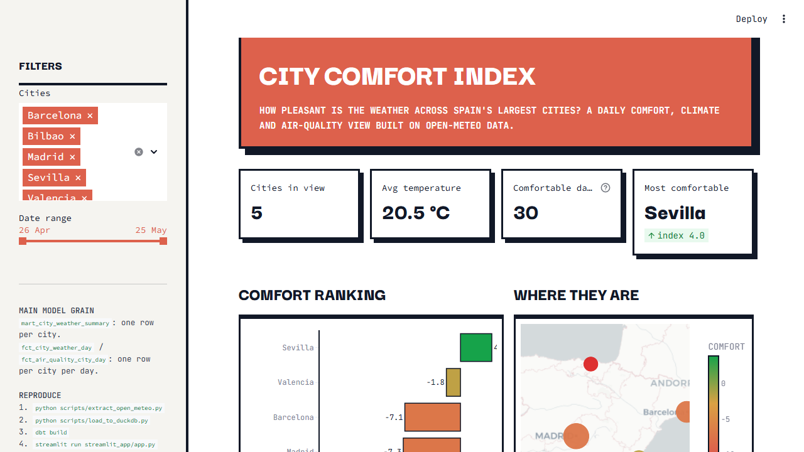

# Open-Meteo Weather Analytics

Final project for **Analytics Engineering @ IE School of Science and Technology**.

An end-to-end analytics pipeline over [Open-Meteo](https://open-meteo.com/) data for
Spain's five largest cities (Madrid, Barcelona, Valencia, Sevilla, Bilbao):

**Open-Meteo APIs → Python extraction → DuckDB → dbt (staging → intermediate → marts) → Streamlit dashboard.**



---

## TL;DR — run it in four commands

```bash
uv sync                                  # install dependencies (or: pip install -e .)
python scripts/load_to_duckdb.py         # load the committed raw CSVs into DuckDB
dbt deps && dbt build                     # build all models + run all tests
python -m streamlit run streamlit_app/app.py   # launch the dashboard
```

The raw CSVs are committed under `data/raw/open_meteo/`, so you can skip extraction and
go straight to `load_to_duckdb.py`. To regenerate them from the live API, see step 1 below.

> **dbt profile:** `profiles.yml` lives in the project root. If dbt can't find the
> profile, run dbt with `--profiles-dir .` or `export DBT_PROFILES_DIR=$PWD` first.

---

## 1. How do I run the extraction?

The extractor pulls from four Open-Meteo endpoints (no API key required) and writes four CSVs.

```bash
# the five rubric cities (matches the committed CSVs):
python scripts/extract_open_meteo.py --cities Madrid Barcelona Valencia Sevilla Bilbao
```

Or run the whole pipeline (extract → load → dbt build) in one command:

```bash
bash scripts/run_pipeline.sh              # full run
bash scripts/run_pipeline.sh --skip-extract   # use committed CSVs
```

Output (written to `data/raw/open_meteo/`):

| File | Source endpoint | Grain |
|---|---|---|
| `raw_locations.csv` | Geocoding API | one row per city |
| `raw_weather_daily.csv` | Forecast API (`past_days`) | one row per city per day |
| `raw_forecast_daily.csv` | Forecast API | one row per city per forecast date per run |
| `raw_air_quality_hourly.csv` | Air Quality API | one row per city per hour |

## 2. How do I load the data?

```bash
python scripts/load_to_duckdb.py
```

This reads `data/raw/open_meteo/*.csv` and registers them as tables in the `raw` schema
of `data/weather_analytics.duckdb`. Re-running it is idempotent (it drops and recreates
each table).

## 3. How do I run dbt?

```bash
dbt deps          # installs dbt_utils, dbt_expectations, dbt_date
dbt build         # runs every model and every test
```

`dbt build` materializes staging and intermediate as **views** and marts as **tables**,
then runs the full test suite (PK uniqueness, not-null, foreign-key relationships,
accepted values, range expectations, and two custom singular tests).

Current run: **12 models, 72 tests, all passing.**

## 4. How do I launch the dashboard?

```bash
python -m streamlit run streamlit_app/app.py
# then open http://localhost:8501
```

The dashboard (the **City Comfort Index**) has a brutalist design, a city filter, a date
filter, and seven visualizations. It reads **only from the mart models**, never the raw files.

## 5. What final models power the dashboard?

| Mart model | Grain | Used for |
|---|---|---|
| `mart_city_weather_summary` | one row per city | KPI cards, comfort ranking, map |
| `fct_city_weather_day` | one row per city per day | temperature trend, day-type breakdown, distribution |
| `fct_air_quality_city_day` | one row per city per day | air-quality comparison |

`dim_location` is the conformed dimension every fact joins back to via `location_sk`.

## 6. What modeling choices did we make and why?

Short version below; the full write-up is in [`docs/modeling_decisions.md`](docs/modeling_decisions.md).

- **Three-layer architecture.** Staging (rename + cast, same grain as source) →
  intermediate (joins, daily aggregation, derived flags, forecast alignment) →
  marts (star schema: one conformed `dim_location` + grain-explicit facts + one wide summary).
- **Surrogate keys everywhere** via `dbt_utils.generate_surrogate_key`, so facts reference
  `dim_location.location_sk` and every fact has a `relationships` test back to the dimension.
- **Comfort metrics defined in SQL, not the app.** `is_comfortable`, `comfort_score` and
  `overall_comfort_index` live in the marts so the dashboard stays a thin presentation layer.
- **A wide summary mart** (`mart_city_weather_summary`) denormalizes the per-city rollups so
  the dashboard's headline views are a single fast read.

---

## Project structure

```text
analytics-engineering-fp/
├── data/raw/open_meteo/        # committed raw CSVs (DuckDB file is git-ignored)
├── scripts/
│   ├── extract_open_meteo.py   # pulls the 4 endpoints → CSVs
│   ├── load_to_duckdb.py       # CSVs → DuckDB raw schema
│   └── run_pipeline.sh         # extract → load → dbt build, one command
├── models/
│   ├── sources.yml             # 4 registered sources
│   ├── staging/                # stg_* (4 views) + docs/tests
│   ├── intermediate/           # int_* (3 views) + docs/tests
│   └── marts/                  # dim/fct/mart (5 tables) + docs/tests
├── tests/                      # 2 custom singular tests
├── streamlit_app/app.py        # City Comfort Index dashboard
├── docs/                       # screenshot + modeling_decisions.md
├── dbt_project.yml  packages.yml  profiles.yml  pyproject.toml
└── README.md
```

## Testing

Tests cover every category the rubric asks for:

- **Primary keys** — `unique` + `not_null` on every surrogate key (staging → marts).
- **Dates / location keys** — `not_null` on grain columns and foreign keys.
- **Relationships** — every fact has a `relationships` FK test to `dim_location`.
- **Accepted values** — `country_code` restricted to `ES`.
- **Ranges** — `dbt_expectations.expect_column_values_to_be_between` on latitude/longitude,
  temperature, AQI, and comfort score.
- **Custom singular tests** — `assert_aqi_non_negative.sql`,
  `assert_temperature_within_realistic_range.sql`.

## Continuous integration

`.github/workflows/ci.yml` runs on every push and PR:

- **pytest** — unit tests for the extraction parsers (`tests_python/`)
- **dbt build** — loads the committed CSVs, builds all models, runs all 72 tests
- **lint** (advisory) — `ruff` for Python, `sqlfluff` for SQL

Pre-commit hooks (`.pre-commit-config.yaml`) run `ruff`, `sqlfluff`, and whitespace
fixers locally — install with `pre-commit install` after `pip install -e ".[dev]"`.

## Deploy to Streamlit Community Cloud

1. Push this repo to GitHub.
2. At [share.streamlit.io](https://share.streamlit.io), create an app pointing at
   `streamlit_app/app.py` on this repo/branch.
3. The committed DuckDB build step must run in the cloud, so add this to the app's
   **"Advanced settings → Python"** or a small startup hook, or commit a prebuilt
   `data/weather_analytics.duckdb` for the demo. Simplest path: add a top-of-app guard
   (already present) that errors clearly if the DB is missing, and build it in the deploy
   command: `python scripts/load_to_duckdb.py && dbt deps && dbt build`.
4. Paste the public URL here once live: **`<add-streamlit-cloud-url>`**

## Known limitation — forecast vs actual

`fct_forecast_city_day` and `int_forecast_vs_actual` are implemented and tested, but the
fact is **empty in a single extraction snapshot**: the Forecast API returns *future* dates
while the weather (actuals) covers *past* days, so the two windows don't overlap. A real
forecast-vs-actual comparison requires accumulating forecast snapshots over time and
joining them to actuals as those dates arrive. The models are ready for that; the data
for it is collected by re-running extraction on a schedule.

## Tech stack

DuckDB · dbt Core (with `dbt_utils`, `dbt_expectations`, `dbt_date`) · Streamlit · Plotly · Python.
